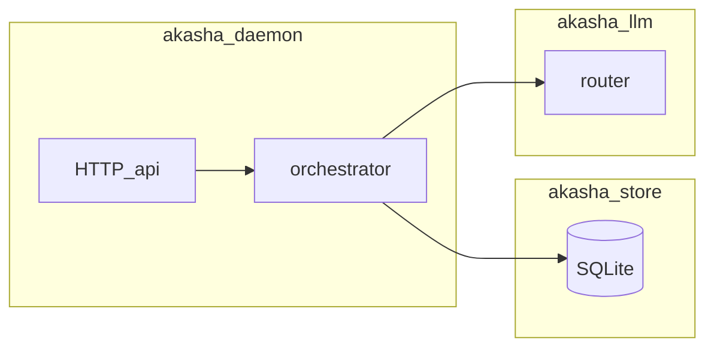

# Frontières entre crates (monorepo Akasha)

Ce document fixe les responsabilités attendues pour limiter les dépendances circulaires et faciliter les refactors.

## Rôles

| Crate | Rôle | Ne doit pas |
|-------|------|-------------|
| **akasha-core** | Types partagés, enveloppes d’événements, spec dir, sécurité prompt basique, merge config | Dépendre du store, LLM, ou du daemon |
| **akasha-store** | Persistance SQLite (tâches, mémoire LT, schedules, workspace graph store) | Appeler le réseau ou le LLM |
| **akasha-llm** | Routage modèles, providers, streaming, métriques LLM | Connaître HTTP daemon ou l’UI |
| **akasha-tools** | Exécution outils (fichiers, shell, policy), conteneurs | Orchestrer des tâches multi-agents |
| **akasha-daemon** | Boucle runtime, HTTP minimal, orchestration agents, canaux | Dupliquer la logique métier du store dans `api.rs` (préférer appeler le store / services) |
| **akasha-vault** | Secrets | — |
| **akasha-embeddings** | Embeddings (optionnel) | — |

## Flux typique

## Règles pratiques

1. **Nouvelle logique persistante** : `akasha-store` ou crate dédié, pas seulement dans `api.rs`.
2. **Nouveau provider / route LLM** : `akasha-llm`, exposer une API stable au daemon.
3. **Réponse HTTP / parsing requête** : préférer `api_http` et petits modules `api_*` plutôt que d’agrandir `api.rs`.

## Anti-patterns observés (daemon HTTP)

1. **Dépendance circulaire `api` ↔ modules de routes** : des handlers dans `api_routes_*.rs` ne doivent pas importer `crate::api` pour éviter les cycles (ex. cache profil agent déplacé dans `agent_profile.rs`).
2. **Sur-délégation dans `handle_api`** : garder le dispatch mince (`if let Some(r) = crate::api_routes_foo::handle...`) ; la logique métier persistante reste dans `akasha-store` / crates métier, pas dupliquée entre `api.rs` et les routes.

## Refactor en cours

Voir [REFACTOR_MONOREPO_TRACKING.md](../quality/REFACTOR_MONOREPO_TRACKING.md).
