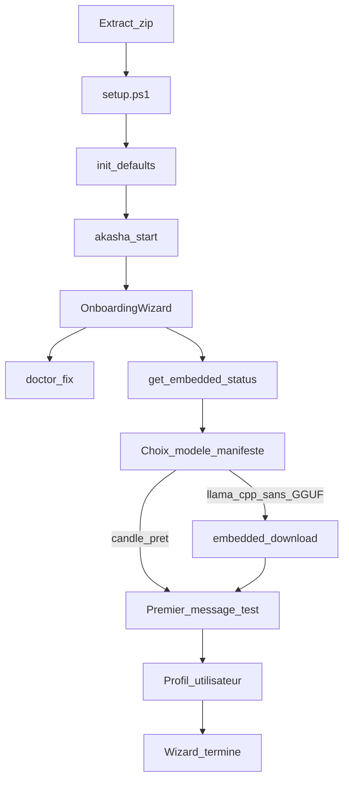

# Roadmap — release 0.10.0 (depuis v0.9.0)

**Statut** : en cours — dernière sync roadmap : 2026-06-21

Document à l’usage des **contributeurs** et de l’équipe release. Complète [internal_release_0.9.md](internal_release_0.9.md), [tests_and_benchmarks.md](../quality/tests_and_benchmarks.md), [embedded-llama-cpp-rfc.md](../roadmap/embedded-llama-cpp-rfc.md) et [34_embedded_small_model.md](../../34_embedded_small_model.md).

---

## Périmètre cible

Référence git : **v0.9.0** → **0.10.0** (`[workspace.package].version` + alignement Tauri / `package.json` via `scripts/sync-release-version.py`).

**Thème transversal v0.10** : **stabilisation de l’application** et **amélioration de l’expérience utilisateur** depuis l’onboarding jusqu’à la **première utilisation réelle** avec les modèles embarqués — incluant packaging GPU complet, CI GPU, veille **modèles (AR, DLM)** et **moteurs d’inférence**, évolution runtime (**Rbitnet**) et **choix multi-modèle** dans le wizard.

La distribution Windows CUDA (correctifs release v0.9.0 post-tag) reste un volet important mais **secondaire** par rapport au parcours first-use ; voir [P4](#p4--release-engineering-et-packaging).

---

## Contexte v0.9.0 / post-tag (déjà sur `main`)

Capitaliser sur le travail déjà livré ; ne pas le re-lister comme objectif principal.

### Build & CI (monorepo Akasha)

| Sujet | État sur `main` | Notes |
|--------|-----------------|--------|
| Runner CUDA Windows | ✅ | Job `akasha-windows-x86_64-cuda` sur **`windows-2022`** (VS 2022) — CUDA 12.9 incompatible avec VS 2026 (`windows-latest`). |
| DLL runtime dans le zip | ✅ | `release.yml` copie `cudart64_*.dll`, `cublas64_*.dll`, `cublasLt64_*.dll` dans `staging/`. |
| Smoke staging CUDA | ✅ | Pas de démarrage HTTP du daemon en CI (`AKASHA_SMOKE_SKIP_DAEMON`) : les runners GitHub n’ont pas **`nvcuda.dll`** (pilote GPU). Vérif layout + DLL runtime. |
| Smoke staging CPU | ✅ | Démarrage daemon + `GET /`, `/api/status`, `/api/docs`, `/api/docs/accueil`. |
| `install.ps1` | ✅ sur `main` | Copie des DLL CUDA runtime vers `InstallDir` — **non inclus dans l’archive v0.9.0** déjà publiée. |

Scripts : `scripts/build-windows-daemon-cuda.ps1`, `scripts/smoke-release-staging.ps1`, `.github/workflows/release.yml`.

### Site Akasha_app (dépôt séparé)

| Sujet | État sur `main` |
|--------|-----------------|
| Lien téléchargement | ✅ Bouton **Windows (CLI, NVIDIA CUDA)** → `akasha-windows-x86_64-cuda.zip` sur [releases.html#downloads](https://azerothl.github.io/Akasha_app/releases.html#downloads). |
| Documentation | ✅ Section [docs.html#installation-cuda](https://azerothl.github.io/Akasha_app/docs.html#installation-cuda) : prérequis pilote NVIDIA, pas de CUDA Toolkit, commandes `setup.ps1` + `config models embedded-download`. |
| One-liner par défaut | Inchangé | `get-akasha.ps1` → **`akasha-full-windows-x86_64.zip`** (build CPU Candle). |

---

## État des lieux — parcours first-use

Gap produit principal v0.10 : l’utilisateur doit pouvoir aller de l’installation à un **premier message réussi** avec le modèle embarqué, sans configuration YAML manuelle ni doc technique.

| Zone | Constat actuel | Références |
|------|----------------|------------|
| Install | `setup.ps1` / `install.ps1` lancent `akasha init --defaults` mais **pas** `embedded-download` | `scripts/install.ps1`, `scripts/setup.ps1` |
| Wizard UI | 6 étapes ; l’étape LLM renvoie vers Réglages — **pas** de statut embarqué, download, multi-modèle ni test premier message | `apps/akasha-ui/src/components/OnboardingWizard.tsx` |
| API embarqué | `GET /api/router/embedded-status` ✅ ; download / progression UI ❌ | `crates/akasha-daemon/src/api.rs`, `crates/akasha-embedded-llm/src/download.rs` |
| Doctor | Check `embedded_llm` avec hint « GGUF missing » ; `--fix` ne télécharge pas | `crates/akasha-cli`, `crates/akasha-embedded-llm` |
| Docs user | `installation.md` : « aucune install externe » ; `depannage.md` : cache HF pour embarqué (partiellement obsolète vs GGUF) | `docs/user/` |
| Bench perf | Bench manuel CUDA uniquement (`bench_embedded_llama_cpp.ps1`) ; pas de gate release structurée CPU + candidats R0 | `spec/dev/quality/bench_embedded_llama_cpp.ps1` |

### Chemins release embarqué

| Artefact | Backend | Modèle | Download onboarding |
|----------|---------|--------|---------------------|
| `akasha-full-windows-x86_64` | Candle | Qwen3 0.6B | Non (lent au 1ᵉʳ appel) |
| `akasha-windows-x86_64-cuda` | llama-cpp-4 + CUDA | Qwen2.5-1.5B Q4 GGUF | **`akasha config models embedded-download`** (~1 Go, [embedded_models.json](../../embedded_models.json)) |
| **`akasha-full-windows-x86_64-cuda`** *(objectif v0.10)* | idem CUDA | idem | idem + wizard multi-modèle |

---

## R0 — Veille modèles locaux et runtimes

Phase de recherche en **tête de cycle v0.10** (durée cible : 1–2 semaines), **avant** de figer les baselines perf et les messages wizard (« premier appel X min »).

### R0a — Modèles autoregressifs (AR) et quants

- [x] Veille **petits modèles** et quants : SmolLM, Qwen3-1.7B, Gemma 3 1B, Phi-4-mini, Llama 3.2 1B/3B, etc. — compromis taille / qualité FR+EN vs Qwen2.5-1.5B Q4 et Qwen3 0.6B Candle.
- [x] Veille **quantification** : Q4_K_M vs IQ4_XS vs Q8_0 — impact tok/s, RAM, qualité pour chat court et `doctor --advice`.

### R0b — Modèles LLM par diffusion (DLM)

Analyse de pertinence pour l’embarqué Akasha, en s’appuyant sur la liste curated **[Awesome-DLMs](https://github.com/VILA-Lab/Awesome-DLMs)** (survey *A Survey on Diffusion Language Models*, dépôt VILA-Lab).

- [x] Cartographier les familles **DLM**
- [x] Évaluer **adéquation cas d'usage Akasha**
- [x] Évaluer **faisabilité technique**
- [x] Identifier **1–2 candidats DLM** — report v0.11 (blockers documentés)
- [x] Décision documentée : **surveiller seulement** / report v0.11

### R0c — Moteurs et stacks d’inférence locale

Veille **écosystème inférence 2026** : cartographier les nouveautés pertinentes pour l’embarqué Akasha, le parcours onboarding et la fiabilité « first message », au-delà du seul choix de modèle (R0a/R0b).

**Sources de référence (non exhaustif)** :

- Panorama outils et formats : [Local LLM Inference in 2026 — Starmorph](https://blog.starmorph.com/blog/local-llm-inference-tools-guide) (Ollama, llama.cpp, vLLM, MLX, LocalAI, Exo, quants GGUF/Q4_K_M, matrice plateformes).
- Architecture mémoire : [Optimizing Local LLM Inference with 2026’s Universal Memory Architecture (UMA)](https://martinuke0.github.io/posts/2026-03-19-decoding-the-shift-optimizing-local-llm-inference-with-2026s-universal-memory-architecture/) (espace d’adressage unifié, CXL 2.0, PMEM, politiques `FAST`/`CAPACITY` — impact TTFT, KV cache, cold-start).
- Fiabilité « modèle supporté » : [Camelid / evidence-gated compatibility](https://www.linkedin.com/pulse/most-local-ai-inference-tools-tell-you-model-supported-shaikh-ajxmc/) (audit token-level vs llama.cpp, taxonomie supported / evidence-only / groundwork-only, `/api/capabilities`).

**Checklist R0c** :

- [x] **Cartographie** : comparer stacks actuelles Akasha
- [x] **UMA / CXL / PMEM** : veille v0.10
- [x] **Correctness & transparence** : evidence-gated implémenté
- [x] **Ollama vs embarqué** : documenté dans note R0
- [x] **Shortlist moteurs** : veille seule
- [x] Décision documentée : **patterns produit v0.10**

### R0d — Runtimes intégrés Akasha (Rbitnet, llama-cpp)

- [x] **Évaluation Rbitnet** — no-go prod v0.10 (note R0d)

### Livrables et protocole communs R0

- [x] Rédiger **`spec/dev/roadmap/embedded_models_research_v0.10.md`**
- [x] Protocole bench par candidat **AR** : SmolLM2 dans `embedded_models.json`, scripts P2b, prompts documentés

**Contraintes** : taille download onboarding &lt; ~1,5 Go ; CPU sans GPU ; release CUDA Windows ; compatibilité manifeste `embedded_models.json` (AR) ; DLM et moteurs — critères TTFT, stack d’inférence et **honnêteté statut embarqué** à valider en R0b/R0c avant engagement produit.

---

## P0 — Parcours first-use unifié

- [x] **`setup.ps1` / `setup.sh`**
- [x] Message clair : zip **full CPU** vs **CUDA**
- [x] **`doctor --json`** : action `embedded-download`
- [x] **`doctor --fix`** : recommandation sans auto-téléchargement
- [x] **`doctor --advice`** : `daemon_checks` inclus
- [x] Invariant documenté : **`init --defaults`** → primary `akasha_embedded` si Ollama absent (`crates/akasha-cli/src/main.rs`).

---

## P1 — Wizard UI et modèles embarqués

- [x] Refonte étape LLM
- [x] Bouton **Télécharger** + barre de progression
- [x] Message Candle prêt
- [x] **Multi-modèle** wizard
- [x] Étape **« Premier message »**
- [x] API **`POST/GET embedded/download`**
- [x] i18n **`onboarding.*`**

---

## P2 — Stabilisation runtime et tests fonctionnels

- [x] Messages UI « chargement du modèle (1–3 min) » (wizard)
- [x] Timeouts Tauri premier message (600s wizard test)
- [x] Statuts **evidence-gated**
- [ ] Erreurs routeur embarqué indisponible → message FR dédié (partiel : hints doctor)
- [x] E2E Playwright wizard (`e2e/wizard-embedded.spec.ts`)
- [x] Test CLI shape `doctor --json` + `daemon_checks`
- [ ] Matrice manuelle release (à valider avant tag)

---

## P2b — Tests de performance modèles embarqués

Objectif : mesurer et documenter les perfs pour valider la stabilisation, calibrer l’UX onboarding et comparer candidats **R0a (AR)**, **R0b (DLM)**, moteurs **R0c** et **R0d (Rbitnet)**.

### Métriques

| Métrique | Usage | Backends |
|----------|-------|----------|
| **TTFT** (time to first token) | Wizard / premier message | Candle CPU, llama-cpp CPU/CUDA |
| **Throughput** (tok/s approx.) | Acceptation release GPU | llama-cpp CUDA (cible v1 : **>20 tok/s** sur GTX 3080+) |
| **Load time** (cold → `embedded_loaded`) | Onboarding, doctor | Tous |
| **End-to-end** (`POST /api/message` → `done`) | Parcours utilisateur réel | Daemon HTTP |

### Checklist

- [x] **`bench_embedded.ps1`** + **`bench_embedded.sh`**
- [x] **`embedded_inference.rs`** (Criterion)
- [x] **`bench_embedded_results.md`** (template baselines)
- [x] Documenté dans tests_and_benchmarks.md §2.3
- [ ] Gate release post-tag (exécuter bench et coller résultats)
- [x] Seuils wizard « 1–3 min »
- [x] CI compile-only
- [ ] **Self-hosted runner GPU** — checklist [GPU_SELF_HOSTED_CI.md](../quality/GPU_SELF_HOSTED_CI.md)

---

## P3 — Documentation et site

- [x] **`docs/user/installation.md`**
- [x] **`docs/user/depannage.md`**
- [x] **`docs/user/commandes.md`**
- [x] **`docs/user/accueil.md`**
- [ ] Regénérer : `python scripts/build-user-docs.py` (si pipeline HTML intégré)
- [x] **Akasha_app** notes v0.10 + full CUDA + compare GPU
- [x] **`get-akasha-cuda.ps1`** + `-Cuda` sur `get-akasha.ps1`

---

## P4 — Release engineering et packaging

- [x] **`python scripts/sync-release-version.py 0.10.0`**
- [ ] Tag **`v0.10.0`** publié (GitHub Release)
- [x] Publier **`akasha-windows-x86_64-cuda.zip`** : binaires llama-cpp-4 + CUDA, DLL runtime, **`scripts/install.ps1`** à jour.
- [x] Publier **`akasha-full-windows-x86_64`** (CPU Candle) sans régression.
- [x] Publier **`akasha-full-windows-x86_64-cuda.zip`** (workflow release.yml)
- [ ] Smoke : CPU daemon HTTP sur GitHub-hosted ; CUDA layout + DLL sur GitHub-hosted ; **smoke HTTP daemon CUDA sur self-hosted runner GPU**.
- [ ] Validation manuelle NVIDIA : extract → `setup.ps1` → `embedded-download` → wizard → premier message → `akasha doctor`.
- [ ] Workflow **Update Release Notes** (Akasha_app) synchronisé avec les artefacts v0.10.0.
- [ ] Veille **CUDA 13.2+** / `windows-latest` (VS 2026) — évaluation sans engagement release v0.10.

### Annexe — Guide install CUDA (référence produit)

À refléter dans `docs/user/` et Akasha_app :

1. Télécharger **`akasha-windows-x86_64-cuda.zip`** (CLI) ou **`akasha-full-windows-x86_64-cuda.zip`** (CLI + UI + scripts).
2. Prérequis : carte **NVIDIA** + **pilotes récents** (`nvcuda.dll` — non fourni dans le zip).
3. Extraire → `.\scripts\setup.ps1 -InstallDir C:\Akasha`.
4. `.\akasha.exe config models embedded-download` (ou via wizard) puis `start`.
5. Variables : `AKASHA_EMBEDDED_BACKEND=auto` (défaut), `AKASHA_EMBEDDED_N_GPU_LAYERS` (défaut 99). Voir [34_embedded_small_model.md](../../34_embedded_small_model.md).

---

## P5 — Runtime embarqué (Rbitnet et DLM)

- [x] Spike **Rbitnet** — no-go documenté (note R0d, pas d'intégration crate)
- [x] DLM / moteurs R0c — no spike (veille)
- [x] Pas de remplacement llama.cpp par défaut
- [x] Plan v0.11 dans note de recherche

---

## Fichiers et emplacements

| Sujet | Emplacements |
|--------|----------------|
| Roadmap / recherche | `spec/dev/releases/roadmap_v0.10.0.md`, `spec/dev/roadmap/embedded_models_research_v0.10.md` ✅ |
| Manifeste modèles | `spec/embedded_models.json`, `spec/34_embedded_small_model.md` |
| RFC backend | `spec/dev/roadmap/embedded-llama-cpp-rfc.md` |
| Install / setup | `scripts/install.ps1`, `scripts/setup.ps1`, `scripts/setup.sh` |
| Build CUDA | `scripts/build-windows-daemon-cuda.ps1`, `.github/workflows/release.yml` |
| Smoke release | `scripts/smoke-release-staging.ps1`, `scripts/smoke-release-staging.sh` |
| Bench perf | `spec/dev/quality/bench_embedded.ps1`, `bench_embedded_results.md` ✅, `crates/akasha-embedded-llm/benches/` ✅ |
| Wizard UI | `apps/akasha-ui/src/components/OnboardingWizard.tsx`, `src/locales/en.json`, `fr.json` |
| API / CLI embarqué | `crates/akasha-daemon/src/api.rs`, `crates/akasha-cli/src/main.rs`, `crates/akasha-embedded-llm/` |
| Runtime Rbitnet | dépôt Rbitnet, intégration `akasha-embedded-llm` |
| CI GPU | `.github/workflows/` (self-hosted runner labels) |
| Site | `Akasha_app/js/main.js`, `docs.html`, `compare.html`, `releases.html` |
| Docs user | `docs/user/*.md`, `scripts/build-user-docs.py` |
| Tests | `apps/akasha-ui/e2e/smoke.spec.ts`, `spec/dev/quality/tests_and_benchmarks.md` |

---

## Critères de clôture v0.10.0

- [x] Refactor `api.rs` L3–L6 (`api_routes_*` × 6, ~16k lignes restantes)
- [x] Workflow GPU CI (`.github/workflows/gpu-ci.yml`) — runner self-hosted à provisionner
- [ ] Parcours **first-use** validé manuellement sur machine NVIDIA (avant tag)
- [x] `akasha doctor` signale `embedded-download` (implémenté)
- [x] Docs FR cohérentes
- [x] **Bench embarqué** : scripts + template baselines
- [x] **Veille R0** publiée
- [ ] Tag **`v0.10.0`** + artefacts publiés (workflow Release)
- [x] **GPU CI** workflow livré ; checklist [GPU_SELF_HOSTED_CI.md](../quality/GPU_SELF_HOSTED_CI.md) — runner opérateur en attente
- [x] Aucune régression smoke CPU/CUDA GitHub-hosted (baseline v0.9)
- [x] Site Akasha_app synchronisé (v0.10.0 — JSON + HTML pills, What's new)

---

## Hors scope v0.10 (report explicite post-arbitrage R0 uniquement)

- Remplacement **complet** de llama.cpp par Rbitnet ou un **DLM** en backend par défaut **sans fallback** — sauf décision contraire documentée dans `embedded_models_research_v0.10.md`.

---

## Ordre de travail suggéré

1. R0 veille (**R0a** AR, **R0b** DLM, **R0c** moteurs d’inférence, **R0d** Rbitnet) + note de recherche.
2. P2b bench (baselines actuelles + candidats R0).
3. P0 install/doctor + P1 wizard (messages perf calibrés).
4. P2 stabilisation + E2E.
5. P5 spike Rbitnet (parallèle possible après R0).
6. P3 docs + Akasha_app.
7. P4 release + self-hosted GPU CI + gate bench.

---

## Historique

- **v0.9.0** : premier artefact `akasha-windows-x86_64-cuda` ; fixes CI VS 2022, bundling DLL, smoke GPU-less — voir [internal_release_0.9.md](internal_release_0.9.md).
- **v0.10.0** *(en cours)* : parcours first-use, wizard embarqué, full CUDA zip, API download, bench scripts, note R0 — tag release pending.
