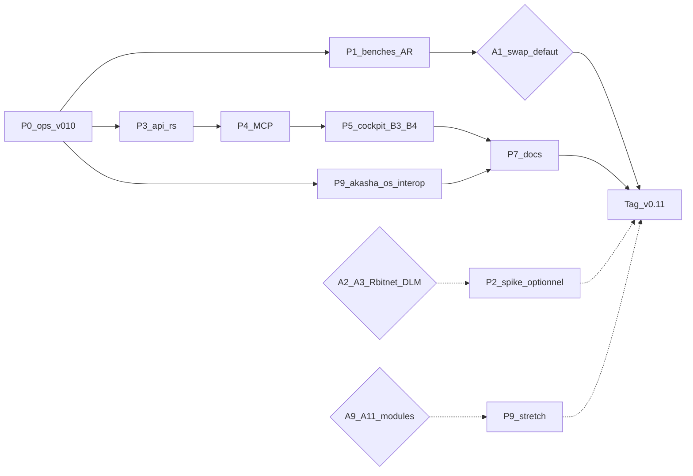

# Roadmap — release 0.11.0 (depuis v0.10.0)

**Statut** : proposition — dernière sync roadmap : 2026-09-26

Document à l’usage des **contributeurs** et de l’équipe release. Complète [roadmap_v0.10.0.md](roadmap_v0.10.0.md), [internal_release_0.10.0.md](internal_release_0.10.0.md), [embedded_models_research_v0.10.md](../roadmap/embedded_models_research_v0.10.md), [REFACTOR_MONOREPO_TRACKING.md](../quality/REFACTOR_MONOREPO_TRACKING.md) et [feature_evolution_tracking.md](../../feature_evolution_tracking.md).

---

## Périmètre cible

Référence git : **v0.10.0** → **0.11.0** (`[workspace.package].version` + alignement Tauri / `package.json` via `scripts/sync-release-version.py` **à la fin du cycle**, pas dans cette PR roadmap).

**Thème transversal v0.11** : **maturiser l’embarqué et la plateforme** après le first-use / cockpit / life layer v0.10 — benches modèles AR pour figer (ou non) le défaut CUDA, durcissement daemon (`api.rs` &lt; 8k, MCP), complétion cockpit reportée (P6 B3/B4), dette doc / release ops, et **rapprochement documenté skills / plugins (daemon) ↔ skills / modules ([akasha-os](https://github.com/azerothl/akasha-os))** via le sibling bridge — **sans** fusionner les binaires ni décider a priori le remplacement de llama.cpp par Rbitnet ou un DLM.

---

## Capitaliser sur v0.10.0 (déjà sur `main` / tagué)

Ne pas re-lister comme objectifs v0.11. Preuves : tag `v0.10.0`, [internal_release_0.10.0.md](internal_release_0.10.0.md), checklist restante post-tag (store projet `docs/v0.10.0-remaining.md`).

| Zone | Livré v0.10 | Notes |
|------|-------------|--------|
| First-use / wizard | Setup, doctor evidence-gated, download GGUF, multi-modèle, premier message, E2E wizard | Artefacts CPU + CUDA + full CUDA |
| Embarqué | Candle CPU + llama-cpp-4 CUDA, manifeste, benches scripts + baselines | Defaut CUDA : Qwen2.5-1.5B Q4_K_M |
| Veille R0 | Note recherche AR/DLM/moteurs/Rbitnet | Décisions : DLM surveiller ; Rbitnet no-go prod v0.10 |
| Cockpit P6 A1–A4 | Active work, modes, Usage 7/30j, pin/fork/dual-pane | Stretch P6 B3/B4 **reportés** |
| Life layer P7 L1–L4 | Overnight, morning brief Telegram, OAuth Connectors, NL schedule | Stretch P7 B3/B4/H5 **livrés** |
| Refactor API L0–L6 | `api_routes_*` + smoke path matching | `api.rs` encore ~16–17k lignes ; cible &lt;8k **reportée** |
| Intégrations | Discovery, Home Assistant, Companion LAN APIs (#122) | Companion ESP32 hardware encore **Planned** |
| CI / packaging | GPU workflow, smoke staging, release artefacts | Runner self-hosted + gates manuels : ops post-tag |

---

## P0 — Clôture ops & dette v0.10 (gates release)

Travail opérateur / doc déjà listé hors tag ; à traiter en tête de cycle pour une baseline mesurable.

- [ ] **Smoke GPU self-hosted** : provisionner runner `self-hosted,gpu,nvidia` ; job `gpu-smoke` vert — [GPU_SELF_HOSTED_CI.md](../quality/GPU_SELF_HOSTED_CI.md)
- [ ] **Gate bench post-tag** : exécuter `bench_embedded.ps1` / `.sh` sur machine de référence ; coller résultats dans [bench_embedded_results.md](../quality/bench_embedded_results.md)
- [ ] **Matrice manuelle first-use** : zip CPU + CUDA → setup → wizard → premier message → `doctor`
- [ ] **Sync `docs/user_guide_final.md`** : `python scripts/build-user-docs.py` (pages first-use/CUDA déjà dans `docs/user/*`)
- [ ] Erreurs routeur embarqué indisponible → message FR dédié (reste partiel P2 v0.10)
- [ ] Veille **CUDA 13.2+** / `windows-latest` (VS 2026) — évaluation sans engagement artefact (report P4 v0.10)

---

## P1 — Embarqué : benches AR & transparence (Must)

Suite directe du [plan v0.11](../roadmap/embedded_models_research_v0.10.md#plan-v011-issues-reportées) et des enseignements [bench_embedded_results.md](../quality/bench_embedded_results.md).

### Must-ship

- [ ] **Bench tier 1–2** (protocole 5 prompts FR + TTFT / tok/s / load) : Qwen3.5-0.8B, Qwen3-0.6B GGUF, Gemma 3 1B QAT, Qwen3-1.7B ; Phi-4-mini hors onboarding
- [ ] Fix / validation **`n_batch`** (arch hybrid Qwen3.5) avant décision produit
- [ ] **Décision documentée** swap défaut CUDA (garder Qwen2.5-1.5B **ou** promouvoir un candidat) — après benches, pas avant
- [ ] Variantes manifeste wizard si un candidat bat le défaut sur FR + contrainte &lt; ~1,5 Go
- [ ] **`GET /api/capabilities`** (style Camelid) : flags GGUF / vision / mmproj / evidence — extension des statuts evidence-gated v0.10
- [ ] Bench A/B **`ngl=0` vs `ngl=99`** sur GPU 4 Go (stratégie device laptop — note Insider / XPS)
- [ ] Veille tier 3 (doc only) : Qwen3.6 / MTP / ROCmFP4 vs stack NVIDIA release

### Stretch

- [ ] Convergence **pull modèle style Ollama** via manifeste (mention R0c — hors v0.10)
- [ ] Variante **IQ4_XS** en candidat bench (pas swap défaut sans preuve)
- [ ] Mode `auto` intelligent CPU llama-cpp vs CUDA selon VRAM libre

### Hors scope P1

- Remplacement **complet** de llama.cpp par Rbitnet ou un DLM **sans fallback** — voir [arbitrages](#arbitrages-ouverts-à-trancher)
- Intégration ROCmFP4 / fork ROCmFPX dans la release Windows NVIDIA

---

## P2 — Runtime embarqué : Rbitnet & DLM (Stretch / arbitrage)

Reprend P5 v0.10 et la note R0 — **pas de décision produit figée ici**.

### Stretch (si arbitrage « go spike »)

- [ ] **Rbitnet** : POC intégration + **bench comparatif** vs llama-cpp-4 (CPU ultra-léger BitNet cité ~34 tok/s Insider — hors llama.cpp stock)
- [ ] **DLM** : spike discret **uniquement si** runtime Rust/Windows mature (blockers R0b : TTFT steps, pas de stack native mature)

### Must documentaire (même sans spike code)

- [ ] Mettre à jour la note recherche (ou annexe v0.11) avec l’état runtime Rbitnet / DLM à la date du spike ou du « no-go renouvelé »
- [ ] llama-cpp-4 reste **backend GPU par défaut** tant qu’aucun arbitrage contraire documenté

### Hors scope P2

- Backend DLM / Rbitnet comme **seul** chemin first-use
- Remplacement Candle bundlé sans chemin GGUF llama-cpp CPU

---

## P3 — Plateforme daemon : `api.rs` &lt; 8k (Must)

[REFACTOR_MONOREPO_TRACKING.md](../quality/REFACTOR_MONOREPO_TRACKING.md) : L0–L6 **faits** ; [internal_release_0.10.0.md](internal_release_0.10.0.md) : cible &lt;8k reportée v0.11 pour la **boucle outils / `execute_tool_call`**.

- [ ] Extraire / découper la boucle outils (`execute_tool_call` et helpers associés) hors du monolithe restant
- [ ] Ramener `crates/akasha-daemon/src/api.rs` **&lt; ~8k lignes** (baseline actuelle ~16–17k)
- [ ] Conserver checklist PR refactor : `cargo check -p akasha-daemon --lib`, tests ciblés, pas de duplication `api_http`
- [ ] Mettre à jour la table métriques dans `REFACTOR_MONOREPO_TRACKING.md`

---

## P4 — MCP runtime → production doc (Must / Stretch)

[`feature_evolution_tracking.md`](../../feature_evolution_tracking.md) : MCP encore **In progress** ; runtime stdio + probe déjà présents — [mcp-runtime.md](../integrations/mcp-runtime.md), [mcp-oauth.md](../integrations/mcp-oauth.md).

### Must-ship

- [ ] Clôturer le statut registre : MCP **Implemented** + doc user minimale (`docs/user/` ou guide opérateur)
- [ ] Allow-list / policy MCP alignée `tools_policy` (ou `mcp_policy.yaml`) — checklist opérateur
- [ ] Surface UI / CLI opérateur stable : status, validate, probe, start/stop stdio (déjà partiel)

### Stretch

- [ ] OAuth 2.1 MCP : tokens dans **vault** (pas fichiers world-readable) — cible [mcp-oauth.md](../integrations/mcp-oauth.md)
- [ ] Attestation checksum packages MCP (pattern `skills.lock.jsonl`)
- [ ] TLS pinning optionnel endpoints SaaS MCP

---

## P5 — Cockpit agentic : reste P6 B3/B4 (Must)

Report explicite post-tag v0.10 ([roadmap_v0.10.0.md](roadmap_v0.10.0.md) §P6 Stretch ; [internal_release_0.10.0.md](internal_release_0.10.0.md)).

> Note : les stretch **P7** B3 (process-watch → wakeup) et B4 (subagent threads dans Active work) sont **déjà livrés**. Ici = items **P6** encore ouverts.

### Must-ship

- [ ] **P6-B3 — Cron watch exit/condition (wakeups)** : abonnements schedule/cron → wakeup agent (au-delà du process-watch P7)
- [ ] **P6-B4 — Subagent threads UI** : inspect + cancel **agrégé** (compléter le groupement enfants déjà dans Active work)

### Stretch / hors tag v0.11 (repris hors scope P6 v0.10)

- [ ] Attach Claude Code / Codex
- [ ] Recipes YAML (Goose-like)
- [ ] Companion PWA, Chrome tab pairing
- [ ] Session replay, Studio checkpoints avancés, computer-use vision, ACP

---

## P6 — Companion LAN / ESP32 (Stretch produit)

APIs Companion LAN livrées via #122 (bind LAN, discovery UDP, `/api/companion/*`, TTS WAV). Hardware / avatar encore **Planned** dans le registre features.

### Stretch

- [ ] Spec + chemin MVP **Freenove FNK0104** (voix-first + avatar) — repo `Akasha_companion`, `/api/voice/*`, présence VAD (`companion_presence.json`)
- [ ] Doc user Companion LAN (pairing secret, discovery :3877)
- [ ] Smoke LAN : daemon bind + device factice / maquette

### Hors scope P6

- Companion PWA mobile (déjà hors tag P6 v0.10)
- Computer-use vision embarqué sur device

---

## P7 — Documentation & dette « Partially documented » (Must)

Liste prioritaire [feature_evolution_tracking.md](../../feature_evolution_tracking.md) — un `Partially documented` ne doit pas traverser une mineure sans ticket.

### Must-ship

- [ ] Plugins avancés (réseau host, schémas map view) — doc user
- [ ] Limites runtime terminal / PTY + prérequis — doc user
- [ ] Options sécurité / politique d’outils avancées — synthèse user
- [ ] Mission autonome (cycle, contracts, observabilité) — section **dev** `spec/`
- [ ] Mettre à jour le registre features (statuts → OK) pour les blocs touchés

### Stretch

- [ ] Sync site **Akasha_app** (Whatʼs new / compare) pour les items must v0.11
- [ ] Notes release satellites (skills/plugins) si API Companion / MCP exposées

---

## P8 — Mémoire & parité (Stretch sélectif)

Matrices Hermes / pi-mono / memory largement **clôturées** (archives → [ROADMAP_FINAL_REGISTRY.md](../roadmap/ROADMAP_FINAL_REGISTRY.md)). Ne pas rouvrir Phase 5. Items **Reporter** utiles en stretch si capacité :

- [ ] **S-MEM-05** chiffrement `memory.db` (SQLCipher / doctor) — [memory_encryption_rfc.md](../roadmap/memory_encryption_rfc.md) ; sinon rester sur chiffrement disque OS
- [ ] UI édition **agent identity** / constitution (gaps C4 / E1 partiels)
- [ ] Fork tree UI v2 (`/tree`) — Reporter pi-mono ; v1 suffit sauf demande produit
- [ ] GraphRAG communautés au-delà de `project:*` (S-RAG-04 Reporter)

---

## P9 — Rapprochement skills / plugins ↔ akasha-os (Must / Stretch)

Objectif : **aligner** (docs + chemins d’import/export) les extensions du daemon Akasha avec le modèle d’extensions d’[akasha-os](https://github.com/azerothl/akasha-os) (Preview), **sans fusionner les binaires** — principe déjà documenté côté OS ([sibling-bridge.md](https://github.com/azerothl/akasha-os/blob/main/docs/sibling-bridge.md), E8 ; anti-roadmap « Do not merge »).

### Lexique (sources réelles — ne pas confondre)

| Terme | Où | Quoi (d’après les dépôts) |
|-------|-----|---------------------------|
| **Skill (daemon Akasha)** | [Akasha_skills](https://github.com/azerothl/Akasha_skills) + `data_dir/skills/` ; [spec 33](../../33_agents_tools_orchestrator_skills.md), [docs/user/extensions.md](../../../docs/user/extensions.md) | Recette agent **Agent Skills** : répertoire + `SKILL.md` (front matter `name` / `description`) ; galerie `skill.json` / `skills.json` ; lock `skills.lock.jsonl` ; API `/api/skills*` |
| **Plugin (daemon Akasha)** | [Akasha_plugins](https://github.com/azerothl/Akasha_plugins) + `data_dir/plugins/` | Outil WASM (`manifest.toml` + `plugin.wasm`) ± **sidecar** natif (Matrix, CalDAV, Home Assistant) ; trust-catalog CI ; `akasha plugin catalog\|install` |
| **Skill (akasha-os)** | `var/skills/<id>/SKILL.md` ; guides [write-a-skill.md](https://github.com/azerothl/akasha-os/blob/main/docs/write-a-skill.md) ; `community/skills/` | Recette Markdown (MIT) pour agents Preview ; champs typiques `when_to_use`, `tools:` ; **pas** un module WASM |
| **Module (akasha-os)** | `var/modules/` + paquet `.aospkg` ; [write-a-module.md](https://github.com/azerothl/akasha-os/blob/main/docs/write-a-module.md) ; `modules/` (SDK Apache-2.0) | Extension **dual-surface** (outils agent + UI déclarative egui) ; catalogue local signé + **cap review** — **≠** plugin WASM tools-only du daemon |
| **Sibling bridge** | [docs/sibling-bridge.md](https://github.com/azerothl/akasha-os/blob/main/docs/sibling-bridge.md), [docs/bridge/](https://github.com/azerothl/akasha-os/tree/main/docs/bridge), binaire `aos-bridged` | Alignement schémas `mem.*` / `secrets.*` / UI déclarative ; HTTP JSON ↔ CBOR bus ; mapping explicite : plugins Wasmtime sibling ↔ modules `.aospkg` = **Partiel — ne pas unifier les ABI encore** |
| **akasha-packages** | [azerothl/akasha-packages](https://github.com/azerothl/akasha-packages) | Dépôt satellite naissant (LICENSE seule au moment de la sync roadmap) — **pas** de format package documenté côté daemon |

> Dans le monorepo Akasha, **aucune** occurrence de `akasha-os` n’était indexée avant cette roadmap ; le rapprochement s’appuie sur les docs OS + satellites + bridge, pas sur du code bridge déjà présent dans ce dépôt.

### Must-ship

- [ ] **Note d’interop** `spec/dev/integrations/akasha-os-sibling-skills-modules.md` (ou équivalent) : tableau skill↔skill, plugin↔module, limites ABI, liens vers sibling-bridge + write-a-skill/module
- [ ] **Matrice de compatibilité `SKILL.md`** : champs communs / divergents (daemon : agentskills.io `name`+`description` ; OS : `when_to_use`, `tools`, `license`) + procédure d’adaptation minimale
- [ ] **Pilote skill partagé** : au moins **un** skill installable des deux côtés (ex. reprise conceptuelle de `morning-brief` OS ↔ skill `Akasha_skills` / life-layer overnight) — même intention produit, chemins d’install documentés
- [ ] **Inventaire catalogues** : lister skills/plugins daemon vs `community/skills` + modules Preview ; marquer « portable » / « daemon-only » / « OS-only »
- [ ] Doc user courte : section « extensions vs akasha-os » (ou renvoi depuis [extensions.md](../../../docs/user/extensions.md)) — pas de promesse marketplace unifié
- [ ] Référencer le bridge dans la doc dev daemon (lien `docs/bridge/` JSON Schema) pour mémoire / secrets **si** un client HTTP optionnel est prévu (sinon doc seule = DoD min)

### Stretch

- [ ] Client optionnel daemon → `aos-bridged` (`127.0.0.1:24710`) pour smoke `mem.*` / `secrets.*` (contrat déjà live côté OS Preview)
- [ ] Script / CI : valider qu’un sous-ensemble `Akasha_skills` reste chargeable tel quel sous Preview (`var/skills/`) après adaptation front matter
- [ ] Export / packaging d’un plugin WASM daemon vers un **module script** OS (façade) — **uniquement** si arbitrage A9 = go ; sinon garder deux stacks
- [ ] Façade « assistant as module » (next step sibling-bridge) — post-stabilisation ABI
- [ ] Suivi `akasha-packages` si un format de distribution commun émerge
- [ ] Sync métadonnées catalogue `Akasha_app` (skills/plugins) avec mentions OS Preview

### Hors scope P9

- Fusionner **Akasha** + **akasha-os** en un seul binaire / installateur (anti-roadmap OS)
- Unifier de force l’ABI Wasmtime plugins ↔ `module_rt` / `.aospkg` (sibling-bridge : Partiel)
- Marketplace public unique avant catalogues locaux + attestation (OS E10 ; daemon trust-catalog)
- Re-implémenter les canaux chat / Companion dans le noyau OS

---

## Critères de clôture v0.11.0

- [ ] Versions alignées **0.11.0** (workspace + Tauri) via `sync-release-version.py` **en fin de cycle**
- [ ] Carte d’architecture régénérée (`spec/dev/architecture/` — diagramme HTML + `architecture-graph.json`) avant le tag — [architecture/README.md](../architecture/README.md)
- [ ] Tag **`v0.11.0`** + artefacts Release (CPU / CUDA / full) sans régression smoke GitHub-hosted
- [ ] Benches AR tier 1–2 publiés + **décision défaut CUDA** documentée
- [ ] `api.rs` **&lt; ~8k** lignes ; check daemon + tests outils verts
- [ ] MCP : statut registre **Implemented** + doc user minimale
- [ ] P6-B3 et P6-B4 livrés (ou report explicite avec justification capacité)
- [ ] Dette doc « Partially documented » prioritaire résorbée (ou tickets GitHub associés)
- [ ] GPU CI self-hosted : au moins un run `gpu-smoke` documenté (vert ou bloqueur opérateur noté)
- [ ] Note Rbitnet/DLM : spike **ou** no-go renouvelé (pas de silence)
- [ ] **P9** : note d’interop + matrice `SKILL.md` + pilote skill partagé + inventaire catalogues publiés
- [ ] Site / `api/latest.json` synchronisés pour la bannière update

---

## Hors scope v0.11 (explicite)

Reprend les hors scope Phase 5 / P6–P7 v0.10 non réouverts :

- Auth multi-user, WhatsApp/Signal natifs, Email IMAP, PWA mobile, RPC stdio pi-mono
- Sandboxes Modal/Singularity, RL trajectoires, GraphRAG hypergraphes
- Remplacement llama.cpp **sans fallback** par Rbitnet ou DLM (sauf arbitrage documenté contraire)
- Attach externe IDE, recipes Goose complètes, Chrome extension, session replay, ACP, computer-use vision
- Fusion binaires Akasha ↔ akasha-os ; unification forcée ABI plugins ↔ modules (voir P9)

---

## Arbitrages ouverts (à trancher)

Ne pas décider à la place du product owner au-delà des notes R0 / sibling-bridge existantes.

| # | Question | Options documentées | Source |
|---|----------|---------------------|--------|
| A1 | **Swap défaut CUDA** après benches ? | Garder Qwen2.5-1.5B Q4_K_M **ou** promouvoir Qwen3.5-0.8B / Gemma 3 1B / Qwen3-1.7B | Note R0a + bench results |
| A2 | **Rbitnet** en v0.11 ? | Veille seule **ou** POC + bench comparatif (no-go prod v0.10 ; optionnel v0.11) | R0d + plan v0.11 |
| A3 | **DLM** en v0.11 ? | Continuer « surveiller seulement » **ou** spike si runtime Rust/Windows mature | R0b |
| A4 | **MCP OAuth vault** | Must-ship v0.11 **ou** stretch / report | mcp-oauth.md |
| A5 | **Companion ESP32** hardware | Stretch MVP voix **ou** rester LAN API-only | feature registry Planned |
| A6 | **Chiffrement memory.db** | Stretch S-MEM-05 **ou** rester Reporter (chiffrement OS) | ROADMAP_FINAL_REGISTRY |
| A7 | **P6-B3/B4** bloquent-ils le tag ? | Must-ship strict **ou** report justifié si capacité insuffisante | roadmap / internal 0.10 |
| A8 | **Convergence format skill** | Conserver deux dialectes `SKILL.md` + guide d’adaptation **ou** profil commun (sous-ensemble agentskills.io + champs OS) | Akasha_skills + write-a-skill OS |
| A9 | **Plugins WASM ↔ modules `.aospkg`** | Rester stacks séparées (recommandation bridge actuelle) **ou** POC façade module | sibling-bridge mapping Partiel |
| A10 | **Client `aos-bridged` dans le daemon** | Doc seule (must P9) **ou** smoke HTTP optionnel v0.11 | sibling-bridge live Preview |
| A11 | **« Assistant as module »** | Report post-v0.11 **ou** spike façade dual-surface | sibling-bridge next steps |

---

## Ordre de travail suggéré

1. **P0** — gates ops v0.10 (GPU CI, benches collés, user_guide_final, matrice manuelle).
2. **P1** — benches AR + `/api/capabilities` + décision A1 (swap défaut).
3. **P3** — découpage `api.rs` / boucle outils (parallèle possible avec P1).
4. **P9** must — note d’interop + matrice `SKILL.md` + inventaire (parallèle doc ; avant stretch bridge).
5. **P4** must MCP (doc + policy) ; OAuth selon A4.
6. **P5** — P6-B3 puis P6-B4.
7. **P7** — dette doc Partially documented (continu, non bloquant seul).
8. **P2** — uniquement après arbitrages A2/A3 (spike ou no-go renouvelé).
9. **P6 / P8 / P9 stretch** — Companion / mémoire / bridge client selon A5–A6 / A9–A11.
10. Sync version **0.11.0** + tag + Release + Akasha_app.

---

## Fichiers et emplacements

| Sujet | Emplacements |
|--------|----------------|
| Cette roadmap | `spec/dev/releases/roadmap_v0.11.0.md` |
| Roadmap / notes v0.10 | `spec/dev/releases/roadmap_v0.10.0.md`, `internal_release_0.10.0.md` |
| Recherche modèles | `spec/dev/roadmap/embedded_models_research_v0.10.md` |
| Bench | `spec/dev/quality/bench_embedded*.md`, `bench_embedded.ps1`, **`bench_ar_v0.11.md`**, `bench_ar_protocol.json` / `.py` |
| Refactor | `spec/dev/quality/REFACTOR_MONOREPO_TRACKING.md`, `crates/akasha-daemon/src/api.rs` |
| MCP | `spec/dev/integrations/mcp-*.md` |
| Skills / plugins daemon | `spec/33_agents_tools_orchestrator_skills.md`, `docs/user/extensions.md`, satellites `Akasha_skills` / `Akasha_plugins` |
| akasha-os (externe) | [azerothl/akasha-os](https://github.com/azerothl/akasha-os) — `docs/sibling-bridge.md`, `docs/write-a-skill.md`, `docs/write-a-module.md`, `docs/bridge/` |
| Features / Companion | `spec/feature_evolution_tracking.md`, Companion LAN APIs daemon |
| Registre clôturé | `spec/dev/roadmap/ROADMAP_FINAL_REGISTRY.md` |
| Store projet (miroir) | `/cursor/stores/self/docs/roadmap-v0.11.md` |

---

## Historique

- **v0.9.0** : premier artefact CUDA Windows ; fixes CI / DLL — [internal_release_0.9.md](internal_release_0.9.md).
- **v0.10.0** : first-use embarqué, full CUDA, R0, cockpit P6 A1–A4, life layer P7, refactor L0–L6 — tag publié.
- **v0.11.0** *(proposition)* : maturité embarqué (benches AR), plateforme (`api.rs`, MCP), reste cockpit P6 B3/B4, dette doc, **rapprochement skills/plugins ↔ akasha-os (P9)** ; Rbitnet/DLM + ABI modules en arbitrage.
